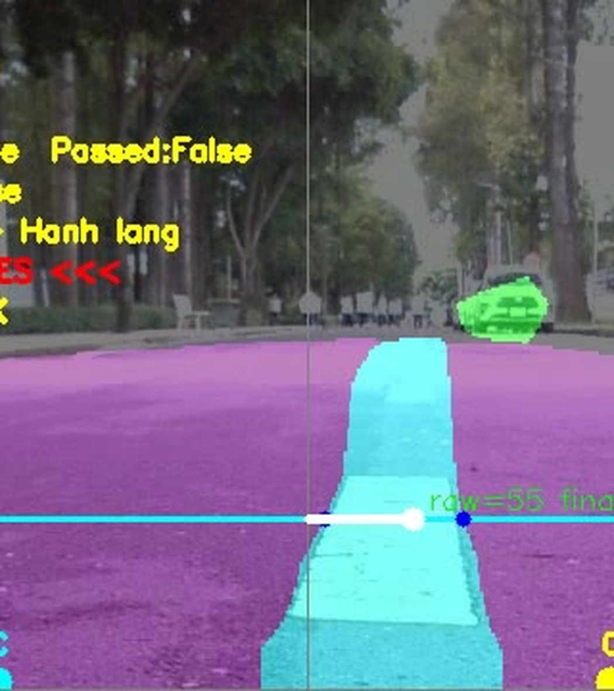
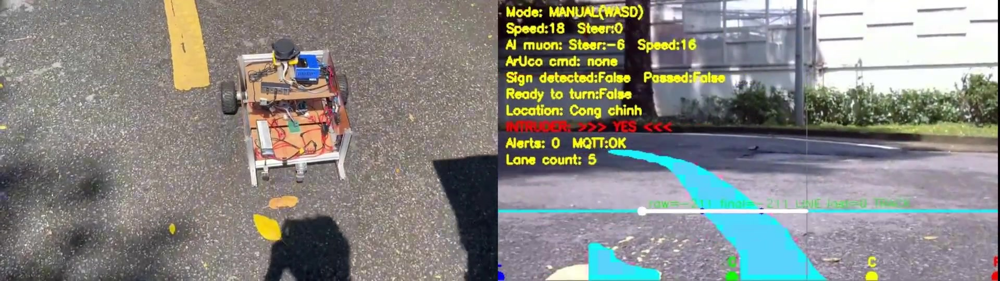
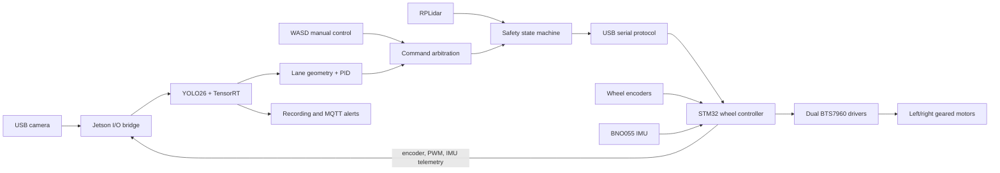
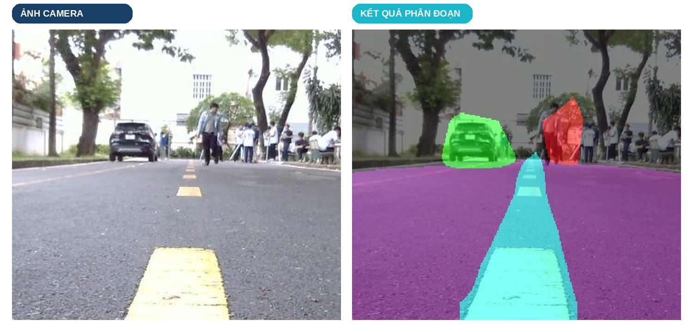
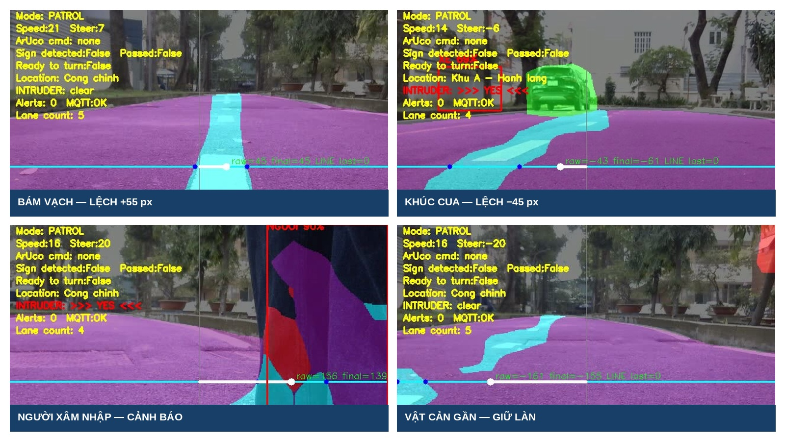
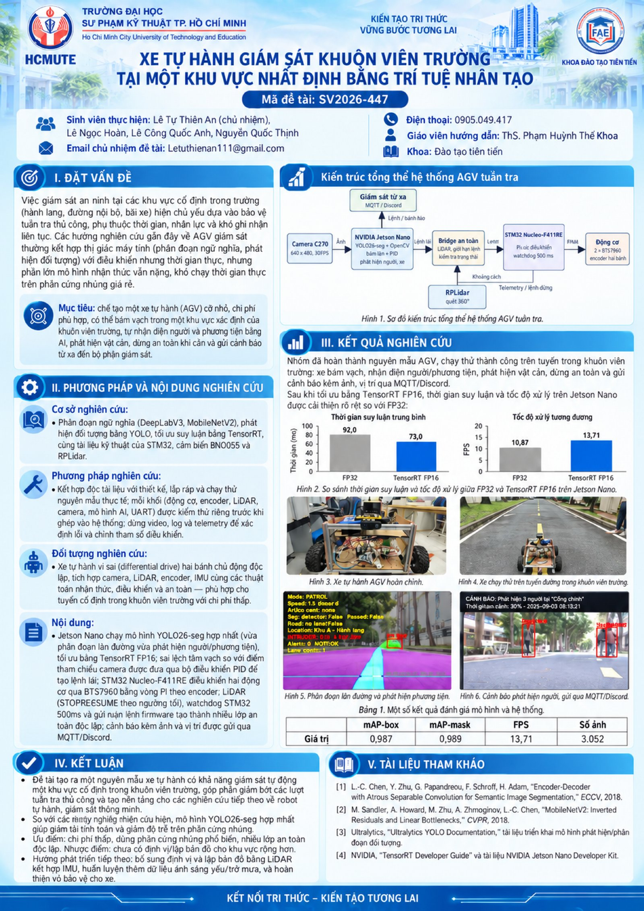

# Autonomous Patrol Vehicle in a Designated Area

[](https://github.com/Letuthienan1112006/autonomous-patrol-vehicle-in-a-designated-area/actions/workflows/tests.yml)


An end-to-end autonomous patrol AGV built on a Jetson Nano and an STM32
Nucleo-F411RE. The vehicle detects road and lane markings, follows the lane,
stops for obstacles, records telemetry, and can be switched to terminal-based
manual control for commissioning and recovery.

> Portfolio project by [Letuthienan1112006](https://github.com/Letuthienan1112006).
> The repository contains source code, firmware, tests, experiment reports,
> and presentation material. Trained weights, TensorRT engines, raw datasets,
> and run videos are intentionally excluded because of their size.



## Real-world demonstration

[](demo/autonomous_patrol_vehicle_demo.mp4)

**[Watch the 1 minute 45 second road-test video](demo/autonomous_patrol_vehicle_demo.mp4).**
The clip shows the completed vehicle operating in its designated test area.

## Highlights

- Unified YOLO26 instance-segmentation pipeline for road, lane marking,
  pedestrian, and vehicle perception.
- TensorRT FP16 inference on Jetson Nano with direct CUDA buffer management.
- Geometry-aware lane error estimation and a smoothed PID steering controller.
- Closed-loop wheel-speed PI control with signed encoders on STM32.
- RPLidar obstacle stop/resume hysteresis, command watchdog, and fail-stop
  behavior when critical sensor data is unavailable.
- WASD manual driving while perception, recording, alerts, and LiDAR safety
  remain active.
- Reproducible run folders containing configuration snapshots, video,
  telemetry, timing, and hardware-monitoring data.
- Automated unit tests for lane geometry, control, safety, telemetry, model
  decoding, and analysis utilities.

## System architecture



The Jetson performs perception and high-level steering. The STM32 executes the
deterministic 100 ms wheel-control loop and stops the motors if commands time
out. See [PROTOCOL.md](PROTOCOL.md) for the serial and socket interfaces.

## Hardware and software

| Layer | Main components |
| --- | --- |
| Compute | NVIDIA Jetson Nano, TensorRT, CUDA, OpenCV, Python |
| Perception | USB camera, YOLO26 segmentation, RPLidar |
| Real-time control | STM32 Nucleo-F411RE, PlatformIO, Arduino framework |
| Motion | Two DC geared motors, signed encoders, dual BTS7960 drivers |
| Orientation | BNO055 IMU |
| Operations | TCP bridge, UART telemetry, MQTT alerts, run recorder |

## Experimental evidence

The controller was tuned from recorded runs rather than only from simulation.
The repository includes reproducible analysis scripts and experiment summaries.

| Segmentation output | Mechanical and road experiments |
| --- | --- |
|  |  |

Measured on the project hardware and current software configuration:

- 239 Python unit tests pass.
- STM32 firmware uses approximately 7.0% flash and 1.2% RAM in the current
  PlatformIO build.
- The optimized FP16 vision path reached about 8.5 FPS in a dry benchmark;
  complete live runs typically measured 5–7 FPS depending on load and power.
- The firmware control and telemetry interval is 100 ms.

These figures are experiment-specific and are not presented as general model
benchmarks. Detailed findings are in
[the lane-control report](reports/AGV_LANE_FIX_20260915.md) and
[the system fix summary](reports/AGV_FIX_SUMMARY_20260911.md).

## Repository map

```text
patrol_robot.py                 Main perception and driving loop
real_car_socket.py              Camera, LiDAR, TCP, and STM32 bridge
lane_control.py                 Lane-following controller
lane_geometry.py                Mask geometry and lane measurements
manual_control.py               Non-blocking terminal driving input
yolo26_*.py                     TensorRT runtime and output decoding
motor_test_bts7960/src/main.cpp Production STM32 motor firmware
tests/                          Unit and regression tests
tools/                          Replay, comparison, and reporting tools
train_data/                     Dataset/training utilities (data excluded)
reports/                        Experiment and diagnosis reports
deliverables/                   Final project presentation and figures
```

## Run the software checks

The unit tests exercise CPU-side logic and do not require the AGV hardware:

```bash
python3 -m venv .venv
source .venv/bin/activate
pip install -r requirements-dev.txt
python -m unittest discover -s tests -q
```

Build the production STM32 firmware with PlatformIO:

```bash
pio run
```

## Deploy on the AGV

Hardware paths, TensorRT engine paths, camera settings, and control gains are
defined in `Confg.py`. The default values reflect the original Jetson setup and
must be calibrated for another vehicle. Typical launch modes are:

```bash
./run.sh dry       # perception only; UART is not opened
./run.sh snap      # capture a small segmentation sample, motors disabled
./run.sh lane      # lane test; LiDAR bypassed, operator supervision required
./run.sh control   # terminal WASD control with LiDAR safety active
./run.sh road      # full autonomous patrol mode
```

Read the safety comments in `run.sh` before operating the motors. First tests
must be performed with the drive wheels lifted. `lane` intentionally bypasses
LiDAR and is only for a cleared, supervised test area.

## Reports and presentation

- [Print-ready A3 project poster (PDF)](deliverables/AGV_Project_Poster_A3.pdf)
- [Final AGV presentation (PPTX)](deliverables/Bao_cao_AGV_NDA_thuc_nghiem.pptx)
- [Browser-viewable project report](reports/bao_cao_agv_nda.html)
- [Communication protocol](PROTOCOL.md)
- [Known issues and engineering lessons](KNOWN_ISSUES.md)

### Project poster

[](deliverables/AGV_Project_Poster_A3.pdf)

## License

No open-source license has been granted yet. The code is published for
portfolio and evaluation purposes; please contact the author before reuse.
